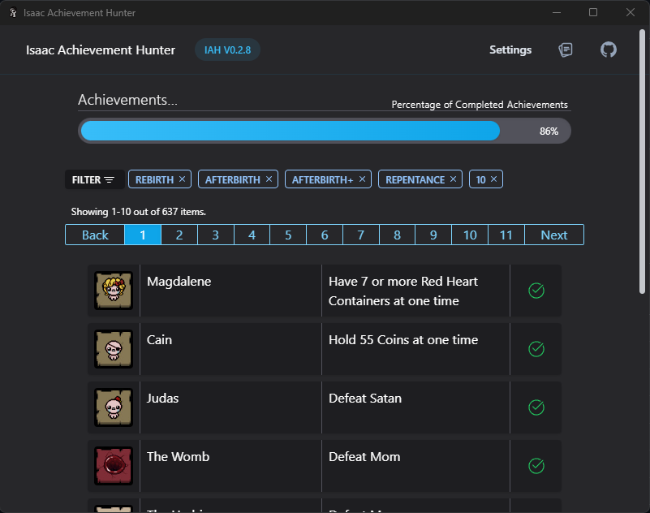

# Isaac Achievement Hunter

## Who am I?

This app was designed to track Steam Achievements, with a simple UI and filter function.

This app uses the Binding of Isaac Wiki and 2 seperate Steam API endpoints to collate all the data into a single table.

## Current Features

-   Filter by Completed/Not Completed
-   Displays completion indicator.
-   Explains achievement unlock criteria.
-   Click on achievement to open the related Wiki page.
-   Displays percentage complete.
-   Paginated by 10, 25, 50, all.

### User Interface:



# How to use?

## As a Product:

Firstly install the application from the msi file, then launch the application.

For personalised results, you will require your Steam User ID. You can get this ID from your Steam profile's URL e.g. https://steamcommunity.com/profiles/{STEAM ID HERE}/.

If you have a custom Steam URL, you may need to use a tool like Steam DB to get your ID.

> **OPTIONAL**: You can include your own Steam API key in the call, but this isn't required.

## For Development:

### Running and building

You can run your own build of the application by using Git Clone and changing parts you want:

```
npm start
```

This command runs a development server and functional application interface to develop on.

```
npm run build
```

This command builds the React application and creates an exectuable built by Tauri.

> **Requirements**: Rust and all NPM dependencies must be installed, including Windows Dev tools with C++ Development tools.

### Generating Versions:

When creating new app features, use semantic versioning:

-   0.0.1 -> Minor patch
-   0.1.0 -> Minor Update / Medium update
-   1.0.0 -> Breaking feature / Major update

Update the version in these places:

-   ./package.json & npm install
-   ./src-tauri/cargo.toml
-   ./src-tauri/tauri.conf.json & npm build
-   When releasing new versions onto GitHub, update [GitHub Gist.](#auto-updater)

## Auto-Updater

I-A-H uses Tauri's built in updater that grabs information from this [GitHub Gist.](https://gist.githubusercontent.com/incendiarybean/d3870a1b591ff30a9ea9f26f9a7e6b3c/raw/2c0a0feeb3615a94395d19d7c6cea3cf8a9f4359/iah-au.json)

Whenever the Version is bumped in this Gist, the launcher will automatically pick up on the version changes and suggest the user upgrades the lastest version.
